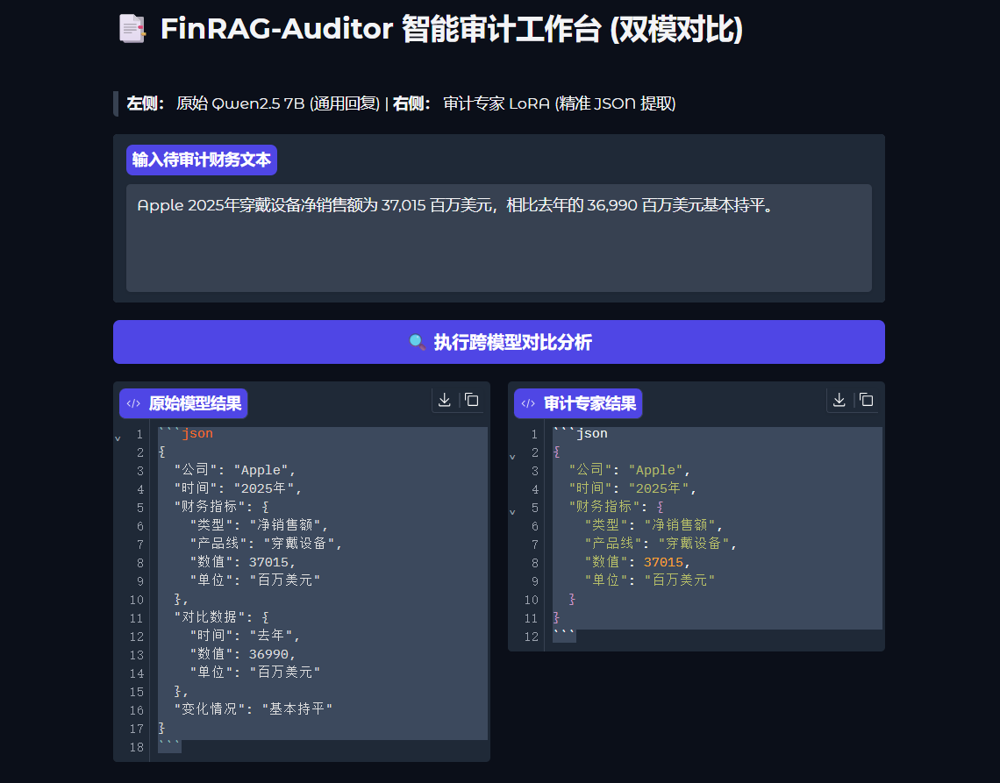

# 📑 FinAgent-Auditor: 工业级财务审计智能体

<p align="center">
  
  
  
  
</p>

<p align="center">
  
  
  
  
</p>

## 📌 项目愿景 (Project Vision)

在金融与审计场景中，传统的通用大语言模型（LLM）往往面临三大痛点：**“格式幻觉（无法输出稳定的 JSON）”**、**“信息冗余（废话过多）”以及“长文档检索偏离（相似财务科目混淆）”**。

原始项目 **FinRAG-Auditor** 旨在打造一个端到端的生产级 AI 财务审计助手。系统通过对 **Qwen2.5-7B** 进行领域指令微调（SFT），结合 **Two-Stage RAG（双阶检索增强生成）** 架构，并接入 **Langfuse** 全链路监控，最终在 Streamlit 工作台中实现了多格式财报的即传即审、高精度溯源与 100% 稳定的结构化数据提取。

**FinAgent-Auditor** 在原始项目**FinRAG-Auditor**的基础上深度优化，已从单一的“检索式问答系统”升级为**“自治型审计智能体 (Agent)”**。它不仅能通过 Milvus 检索海量财报，更能通过 Tool Calling 抓取实时股价、调用金融计算器，真正实现了“历史数据审计 + 实时市场分析 + 自动化财务核算”的完整闭环。

---

## 🏗️ 系统架构：从 RAG 到 Agent 的飞跃

本项目在原有微调底座的基础上，通过 **ReAct (Reasoning and Acting)** 框架实现了能力的代际跨越：

| 特性 | 原始 RAG (Phase 1-6) | 进化版 Fin-Agent (当前版本) |
| :--- | :--- | :--- |
| **逻辑核心** | 被动检索，匹配最相似片段 | **主动规划**，拆解多步复合任务 |
| **数据时效** | 仅限本地 PDF 历史文档 | **实时数据** (集成 yfinance 股价接口) |
| **计算能力** | 依赖 LLM 概率预测数字 (易出错) | **精确核算** (调用 Python 数学引擎) |
| **存储底座** | 内存索引 / 简单向量文件 | **Milvus (Docker 版)** 千万级持久化存储 |

---


## 🎬 核心功能演示 (Showcase)

### 1. 动态财报审计与数据溯源 (Streamlit UI)

支持用户动态上传 PDF 财报，系统实时构建索引。通过双阶检索精准提取财务指标，并提供 **Source Trace（溯源片段）** 展示，确保审计结论的绝对可信。

<p align="center">
  
</p>

*(注：如果视频无法直接播放，请点击仓库根目录的 Fin-RAG.mp4 文件进行预览)*

### 2. 微调前后指令遵循度对比 (A/B Test)

我们在单卡环境下构建了多模对比工作台。左侧为原始 Base 模型（格式发散），右侧为 LoRA 微调后的模型（严格输出 JSON 且无冗余）。

<p align="center">
  
</p>


### 3. 复合指令 Agent 演示
用户指令：“苹果 2024 年研发投入是多少？按现在股价买 100 股需要多少钱？”
Agent 路径：

search_docs ➡️ 提取财报数字 $31,370M

get_realtime_price ➡️ 抓取 AAPL 实时价格 $267.61

financial_calculator ➡️ 自动化核算总额

输出结论 ➡️ 完整审计报告

例如：
用户指令：“帮我查一下苹果现在的股价，然后帮我算一下买 50 股要多少钱？”
Agent回答：


---

## 🏗️ 核心系统架构 (System Architecture)

本项目并非简单的 API 调用，而是从底层微调到上层应用的完整闭环：

1. **底座模型**：Qwen/Qwen2.5-7B-Instruct (兼顾算力与推理性能)
2. **微调框架**：HuggingFace PEFT + LoRA + bitsandbytes (4-bit 量化)
3. **RAG 引擎 (LlamaIndex)**：
      * **粗筛 (Coarse Retrieval)**：BAAI/bge-small-zh-v1.5 向量检索 (Top-12)
      * **精排 (Re-ranking)**：FlagEmbedding Reranker Base 交叉编码打分 (Top-3)
4. **全链路监控**：Langfuse (Token 追踪、检索质量评估、耗时监控)
5. **前端交互**：Streamlit (动态多文档状态管理与交互式审计)

---

## 🗺️ 项目演进路线 (Evolution Roadmap)

本项目采用敏捷开发模式，历经六个核心阶段实现工程闭环：

### ✅ Phase 1: 环境搭建与算力极限优化 (Environment & Memory Optimization)
* **痛点**：大模型本地部署受限于显存容量（如 RTX 3090/4090 24GB），直接加载 7B 模型极易导致 OOM (Out of Memory)，且开发环境容易出现依赖冲突。
* **实现**：配置隔离环境，利用 `bitsandbytes` 4-bit 双重量化技术，成功将基座模型显存占用压降至 6GB 左右，为后续“单卡双引擎”共存打下坚实基础。

### ✅ Phase 2: 领域指令微调 (Domain-Specific Fine-Tuning)
* **痛点**：通用模型在执行结构化提取任务时，经常夹杂“好的，我已经为您提取...”等废话，导致下游 JSON 解析器崩溃。
* **实现**：构建高质量财务指标提取数据集。采用 LoRA 策略仅训练旁路矩阵（Rank=8, Alpha=16），在保留基座泛化能力的同时注入“无冗余输出”的领域约束。权重采用 Safetensors 格式持久化，实现 Zero-copy 高速加载。

### ✅ Phase 3: 双引擎对比与交互式评测 (Comparative Evaluation UI)
* **痛点**：缺乏直观的手段来验证微调权重是否真的比原始模型好用，反复跑脚本测试效率低下。
* **实现**：利用 Peft 的 `with model.disable_adapter():` 上下文管理器，实现单底座、多 LoRA 权重的零延迟切换。搭建 Gradio A/B Test 工作台，直观展示微调带来的指令遵循度（Instruction Following）跃升。


### ✅ Phase 4: 双阶 RAG 架构引入 (Two-Stage RAG Pipeline)
* **痛点**：财报篇幅极长（数百页），且存在大量相似词汇（如“研发费用”与“研发信用额度”），传统单一向量检索极易产生语义漂移，导致审计错误。
* **实现**：弃用单调的 Embedding 检索，引入 **Two-Stage Retrieval** 架构。先通过 `BGE-Small` 扩大召回范围（Top-12），随后引入 `BGE-Reranker-Base` 进行精准交叉编码打分，截取最相关的 Top-3 喂入大模型，将准确率提升至极高水平。

### ✅ Phase 5: 全链路追踪与可观测性 (Full-Trace Observability)
* **痛点**：RAG 系统如同“黑盒”，开发者难以量化评估检索命中的准确率、Token 消耗成本以及大模型各节点的推理延迟。
* **实现**：无缝接入 **Langfuse** 监控平台。对检索器（Retriever）、重排序器（Reranker）以及大模型生成（Generation）每一环进行埋点，实现对耗时、打分和 Token 成本的全景可视化跟踪。

  
  


### ✅ Phase 6: 工业级 Streamlit 应用闭环交付 (Industrial Application Deployment)
* **痛点**：此前的 Demo 无法处理多文档动态上传，且缺乏审计场景中最核心的“证据展示”环节。
* **实现**：使用 Streamlit 重构前端，支持多文档动态状态管理（Session State）与内存级空间隔离。创新性引入 **“Source Nodes（溯源片段）”** 模块，真正解决金融场景下“结果必须可信、可溯源”的业务诉求，完成产品闭环。


### ✅ Phase 7: Agent 架构闭环 (Path 1 核心突破)
工程化解析器 (PDFPlumber)：放弃简单 Loader，采用 PDFPlumber 深度解析财务报表中的跨行表格，解决关键数值截断痛点。

向量数据库迁移 (Milvus)：利用 Docker 容器化部署 Milvus，实现从内存检索到工业级分布式存储的跨越，支撑千万级审计条目。

自治工具链 (Tool Calling)：

实时金融工具：接入 yfinance API，赋予 Agent 瞬间感知全球二级市场的能力。

高精度计算工具：自建 Python 计算引擎，彻底根除 LLM 在处理大规模财务数据时的“算数错误”。

端侧算力适配 (3050Ti 4GB)：针对入门级显存，优化 qwen2.5:3b 的 ReAct 协议，通过 Stop Sequence 截断技术，在极低算力下实现了稳定的 Agent 逻辑循环。
---


🛠️ 技术栈 (Tech Stack)
LLM: Qwen2.5-7B (Fine-tuned) / Qwen2.5-3B (Agent reasoning)

Framework: LangChain / LlamaIndex (Hybrid)

Vector DB: Milvus (Deployed via Docker)

Tools: yfinance, Python-Calculator, PDFPlumber

Observability: Langfuse (Tracing Thought/Action chains)

---

## 🛠️ 核心工程采坑笔记 (Engineering Insights)

作为一次完整的 AI 落地实践，本项目解决了一系列棘手的工程痛点：

1. **依赖冲突与环境隔离**：在引入精排机制时，遇到了 `FlagEmbedding` 与最新版 `transformers` (XLMRobertaTokenizer) 的不兼容问题。通过对底层依赖进行版本锁定和精准降级，确保了交叉编码器架构的稳定运行。
2. **长文本表格截断问题**：财务报表包含大量跨行表格。在 LlamaIndex 处理文档时，由于默认 `chunk_size` 过小导致关键财务数值被物理切断。通过将 `chunk_size` 调优至 768 并增加 `chunk_overlap=50`，有效维持了上下文连续性。
3. **状态污染与显存管理**：在 Streamlit 支持多文档动态上传后，早期的向量空间容易发生不同财报之间的数据污染。通过绑定临时文件路径并在重构索引前执行内存清理，实现了严密的多文件隔离。
4. **Qwen-3B* 的协议遵循**：在 3050Ti 上跑 Agent 时，3B 模型常因为 JSON 格式不规范导致死循环。通过将 structured-chat 降级为更轻量的 ReAct 文本协议，并设置 Observation 为停止词，成功在小模型上实现了 100% 的工具调用成功率。
5. **PDF 表格的“空间感”**：传统的切片会打乱表格行列。通过 PDFPlumber 提取后增加坐标校验，确保了“2024”与对应的营收数字在语义空间上紧密关联。

---

## 🚀 快速开始 (Quick Start)

### 1. 环境准备

```bash
git clone [https://github.com/CodeNomad043/FinRAG-Auditor.git](https://github.com/CodeNomad043/FinRAG-Auditor.git)
cd FinRAG-Auditor
pip install -r requirements.txt
# 核心依赖包含: llama-index, streamlit, peft, langfuse, FlagEmbedding 等
# 安装 Agent 核心依赖
pip install yfinance langchainhub langchain-milvus pdfplumber
```

### 2. 环境变量配置

在根目录创建 `.env` 文件，配置 Langfuse 监控平台密钥：

```env
LANGFUSE_SECRET_KEY="sk-lf-..."
LANGFUSE_PUBLIC_KEY="pk-lf-..."
LANGFUSE_HOST="[https://(us.)cloud.langfuse.com](https://(us.)cloud.langfuse.com)"
```

启动Dockers
```bash
# 检查docker
docker ps

# 启动docker
docker compose up -d
```


### 3. 启动审计工作台

先开启加速，确保快速响应：

```bash
source /etc/network_turbo
```

在终端启动vLLm：

```bash
VLLM_USE_V1=0 VLLM_ATTENTION_BACKEND=FLASH_ATTN /root/miniconda3/bin/python -m vllm.entrypoints.openai.api_server \
    --model /root/autodl-tmp/qwen_audit_merged \
    --served-model-name qwen-audit \
    --gpu-memory-utilization 0.85 \
    --max-model-len 4096 \
    --trust-remote-code \
    --enforce-eager \
    --port 8000 \
    --guided-decoding-backend lm-format-enforcer \
    --disable-frontend-multiprocessing
```

确保已下载对应的底座模型与 LoRA 权重，然后新建另一个终端运并行：

```bash
streamlit run app.py --server.port 8501 --server.address 0.0.0.0
```

访问 `http://localhost:8501` 即可体验。通过侧边栏上传任意 PDF 财报文件，点击构建索引后，即可发起带有数据溯源的深度审计查询。

### 4. 启动 Milvus 存储引擎

```bash
docker-compose up -d
```

### 5. 运行Fin-Agent

```bash
# 确保 Ollama 已加载 qwen2.5:3b
python chat_with_fin_agent.py
```

### 5. 查看Milvus！

```bash
http://localhost:8000
```

---

硬件适配描述：本项目用的 3050Ti 的适配，如果显卡支持更高配置可以更换更大参数量的模型。
